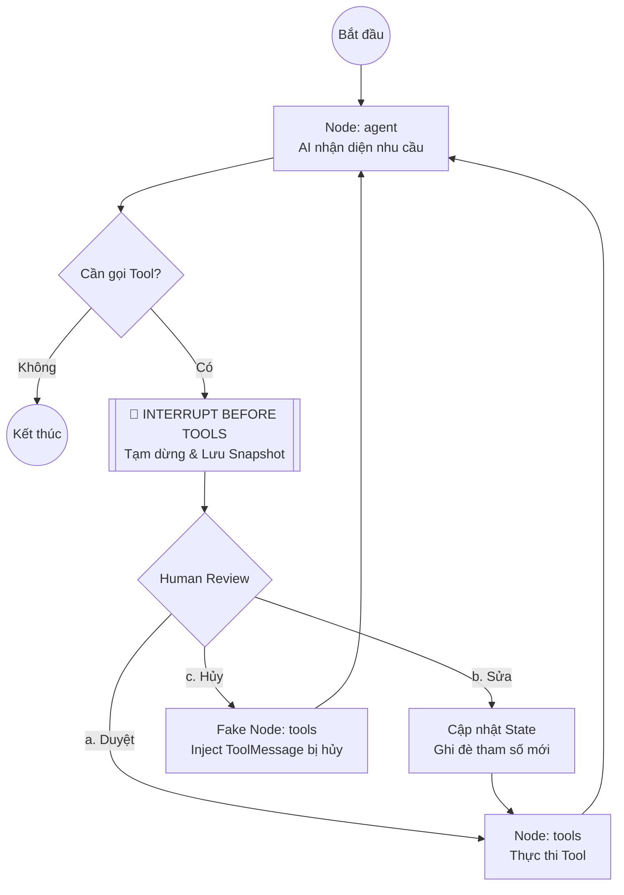

# Human-In-The-Loop (HITL) với LangGraph 👤🤖

Dự án này mô phỏng một thiết kế mẫu (Design Pattern) cực kỳ quan trọng trong việc phát triển AI Agent: **Human-In-The-Loop (Con người giám sát quy trình)**. 

Trong ngữ cảnh các hệ thống Agent thực hiện các hành động có rủi ro cao như *giao dịch tài chính*, *xóa dữ liệu*, hoặc *gửi email cho khách hàng hàng loạt*, chúng ta **bắt buộc** phải có bước dừng lại để con người phê duyệt, chỉnh sửa hoặc từ chối trước khi hành động thực tế xảy ra.

---

## 💡 Kiến trúc & Cách thức hoạt động

Dự án sử dụng cơ chế **State Snapshot**, **Checkpointer** và **Breakpoints (Ngắt)** nguyên bản từ LangGraph:



---

## 📁 Cấu trúc dự án

*   `hitl_demo.py`: Script Python chính chứa toàn bộ logic Graph, các Tools giả lập, và giao diện dòng lệnh tương tác để thực thi HITL.
*   `config.py`: Nạp biến môi trường từ file `.env`.
*   `pyproject.toml`: Quản lý các thư viện phụ thuộc thông qua công cụ `uv`.
*   `.env`: Chứa cấu hình trỏ tới Local LLM (mặc định là `http://127.0.0.1:1234/v1`).

---

## ⚡ Hướng dẫn Cài đặt & Khởi chạy

Do dự án được quản lý bằng `uv`, bạn có thể chạy trực tiếp mà không cần cài đặt thủ công qua `pip`.

1.  Đảm bảo máy chủ Local LLM của bạn đang chạy (ví dụ: LM Studio tại `http://127.0.0.1:1234`).
2.  Chạy lệnh sau để khởi động demo:

```bash
cd /data/learning/agent/agent_design_pattern/HITL
uv run hitl_demo.py
```

---

## 🎯 Các kịch bản thử nghiệm được hỗ trợ

### 🟢 Kịch bản 1: Tự động thực thi (Không cần can thiệp)
*   **Yêu cầu**: "Tra cứu số dư của tôi."
*   **Hành vi**: AI sẽ tự gọi tool `check_balance` và trả về kết quả ngay lập tức mà **không cần bạn ấn xác nhận**. Vì đây là tác vụ chỉ đọc (Read-only).

### 🟠 Kịch bản 2: Chấp thuận (Approve)
*   **Yêu cầu**: "Chuyển 2.000.000 đồng cho anh Nam."
*   **Hành vi**: Hệ thống hiện bảng **🔔 CẢNH BÁO BẢO MẬT**. Chọn **[A]** để chấp thuận.
*   **Kết quả**: Hệ thống tiếp tục thực thi tool `transfer_money` và thông báo thành công.

### 🔴 Kịch bản 3: Từ chối (Reject)
*   **Yêu cầu**: "Gửi cho Huy 5.000.000 VNĐ."
*   **Hành vi**: Hệ thống hiện bảng cảnh báo. Chọn **[R]** để từ chối.
*   **Kết quả**: Tool `transfer_money` **không bao giờ được chạy**. Một tin nhắn từ chối giả lập sẽ gửi ngược lại cho AI để nó trả lời bạn một cách lịch sự là giao dịch đã hủy.

### 🟡 Kịch bản 4: Chỉnh sửa tham số (Modify)
*   **Yêu cầu**: "Chuyển 100 triệu cho Hùng."
*   **Hành vi**: Hệ thống hiện bảng cảnh báo. Bạn thấy 100 triệu là quá nhiều, chọn **[M]**.
*   **Hành vi tiếp theo**: Giao diện cho phép sửa trường `amount` thành `10000000` (10 triệu) và sửa `recipient` thành `Hùng (VIP)`.
*   **Kết quả**: AI nhận cập nhật vào state và tiến hành chuyển số tiền đã sửa thay vì số ban đầu.
