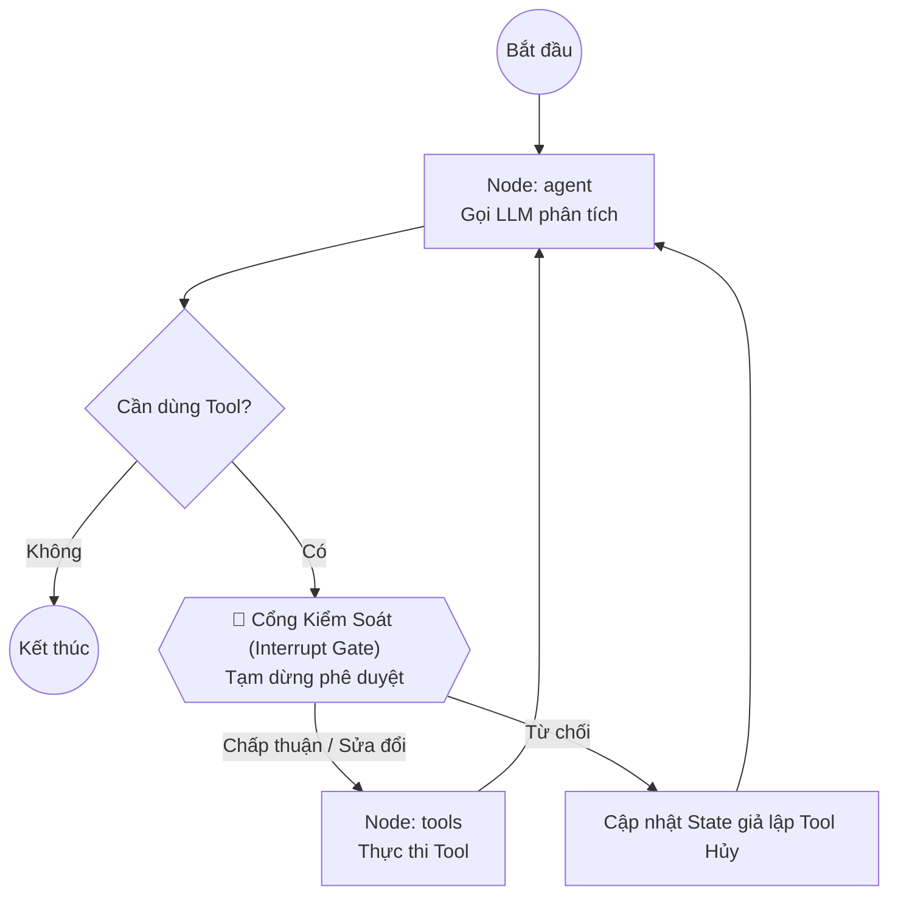

# Báo cáo Giải thích Mã nguồn: Mô hình Human-In-The-Loop (HITL) trong LangGraph

Tài liệu này cung cấp giải thích chi tiết về kiến trúc và cách triển khai mã nguồn Demo HITL ứng dụng trong phê duyệt giao dịch tài chính tại thư mục `agent_design_pattern/HITL`.

---

## 🚀 1. Tổng quan luồng hoạt động (Architecture)

Mã nguồn chính được triển khai trong file `hitl_demo.py`. Toàn bộ quá trình hoạt động được xây dựng dựa trên một đồ thị trạng thái tuần tự, có điểm kiểm soát bảo mật trước khi gọi các công cụ quan trọng (sensitive tools).



---

## 🔍 2. Chi tiết các thành phần trong mã nguồn

### A. Khai báo các Công cụ (Tools)
Hệ thống chia làm 2 cấp độ an toàn cho công cụ:
1. **Công cụ An toàn (`check_balance`)**: Dùng để kiểm tra số dư. Hành động này không thay đổi trạng thái hệ thống và mang tính đọc (Read-only), tuy nhiên trong demo này nó vẫn đi qua luồng kiểm tra tổng quát.
2. **Công cụ Nhạy cảm (`transfer_money`)**: Thực hiện chuyển tiền đi. Đây là mục tiêu chính cần sự giám sát của con người.

### B. Thiết lập Đồ thị và Điểm ngắt (Graph & Interrupt Configuration)
* **State Definition**: Sử dụng `TypedDict` kế thừa lịch sử tin nhắn.
* **MemorySaver**: Cơ chế ghi nhớ trạng thái (checkpoint) bắt buộc trong LangGraph để hỗ trợ tạm dừng luồng chạy và tái kích hoạt lại từ đúng điểm dừng đó nhờ `thread_id`.
* **Cấu hình Biên dịch Graph (`workflow.compile`)**:
  ```python
  graph = workflow.compile(
      checkpointer=memory,
      interrupt_before=["tools"] # Tự động dừng Graph trước khi chạm vào Node 'tools'
  )
  ```
  Cấu hình `interrupt_before=["tools"]` đảm bảo rằng bất kỳ khi nào AI quyết định gọi tool, luồng xử lý sẽ bị đóng băng hoàn toàn để chờ lệnh từ phía người quản lý.

---

## 🛠️ 3. Cơ chế Can thiệp của Người dùng (HITL Control Panel)

Khi đồ thị bị dừng tại Node `tools`, hàm `handle_hitl(config)` được kích hoạt để hiển thị snapshot hiện tại và đưa ra 3 lựa chọn xử lý thông minh trực tiếp tác động vào State:

### 🟢 Kịch bản 1: Chấp thuận (Approve)
* **Cách thực hiện**: Gọi `graph.stream(None, config, stream_mode="values")`.
* **Cơ chế**: Tham số đầu vào truyền vào là `None` báo hiệu cho LangGraph lấy toàn bộ trạng thái đã lưu trong Checkpointer ra và tiếp tục thực hiện bước tiếp theo (thực thi Tool Node).

### 🔴 Kịch bản 2: Từ chối (Reject)
* **Cách thực hiện**:
  1. Tạo các `ToolMessage` thông báo lỗi/hủy từ người dùng kèm theo `tool_call_id` tương ứng.
  2. Gọi `graph.update_state(config, {"messages": tool_cancellation_messages}, as_node="tools")`.
  3. Tiếp tục cho đồ thị chạy tiếp.
* **Cơ chế**: Bằng cách truyền cờ `as_node="tools"`, hệ thống đánh lừa Graph rằng Node `tools` đã tự thực thi và trả về kết quả này. Việc này giúp chặn đứng việc gọi API thật nhưng vẫn giữ cho cấu trúc lịch sử tin nhắn của Graph đi tiếp một cách tự nhiên để phản hồi lại cho người dùng.

### 🟡 Kịch bản 3: Chỉnh sửa Tham số (Modify)
* **Cách thực hiện**:
  1. Nhận input sửa đổi từ bàn phím (ví dụ: sửa lại tên người nhận hoặc số tiền chuyển khoản).
  2. Tạo ra một đối tượng `AIMessage` mới chứa các tham số đã chỉnh sửa, giữ nguyên thuộc tính `id` gốc của tin nhắn AI trước đó.
  3. Gọi `graph.update_state(config, {"messages": [new_ai_message]}, as_node="agent")`.
* **Cơ chế**: Tham số `as_node="agent"` kết hợp trùng khớp `id` của tin nhắn sẽ ghi đè trực tiếp lên nội dung yêu cầu gọi tool cũ của AI bằng nội dung mới an toàn hơn đã qua kiểm duyệt. Khi Graph tiếp tục chạy, Node `tools` sẽ nhận các tham số đã được chuẩn hóa này.

---

## 💡 4. Đánh giá Ưu điểm Thiết kế

1. **Bảo mật ở mức hạ tầng (Infrastructure-level safety)**: Việc ngắt ở tầng Graph giúp loại bỏ hoàn toàn nguy cơ AI thực thi lệnh ngoài mong muốn (Prompt Injection), vì việc thực thi Tool được tách biệt hoàn toàn khỏi tư duy của LLM bởi Cổng Kiểm Soát.
2. **Kiểm soát Trạng thái Thông minh**: Thay vì can thiệp cứng vào các biến logic cục bộ, việc cập nhật trực tiếp vào State đồ thị (`graph.update_state`) giữ cho toàn bộ lịch sử hội thoại đồng nhất, dễ debug và theo dõi vết (trace audit).
3. **Tăng Trải nghiệm Người dùng**: Cơ chế **Modify** trực quan giúp người dùng nhanh chóng sửa lỗi do AI trích xuất sai thông tin mà không cần phải gõ lại câu lệnh từ đầu.
