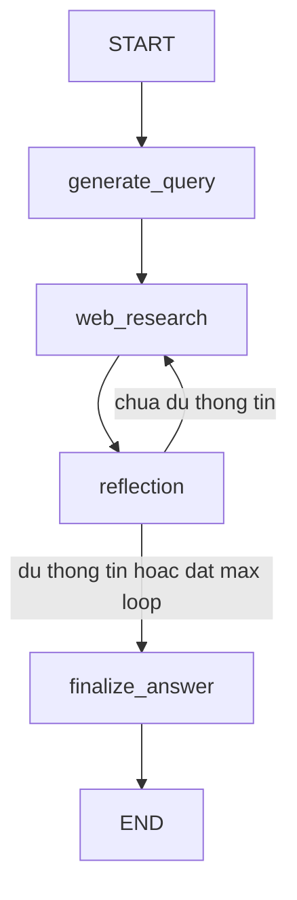
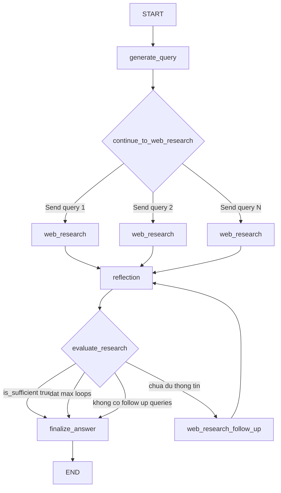

# Deep Research with Reflection

Ví dụ LangGraph cho luồng **Deep Research / Nghiên cứu Sâu với cấu trúc Phản tư**, phỏng theo graph structure của `google-gemini/gemini-fullstack-langgraph-quickstart`.

## Flow



Fallback text: `START -> generate_query -> web_research -> reflection -> web_research | finalize_answer -> END`.

## Nodes

| Node | Vai trò |
|------|---------|
| `generate_query` | Tạo nhiều truy vấn tìm kiếm từ câu hỏi gốc |
| `web_research` | Tìm kiếm web, gom source, sinh ghi chú có citation |
| `reflection` | Tự đánh giá thông tin đã đủ chưa, tìm knowledge gap |
| `finalize_answer` | Tổng hợp câu trả lời cuối từ các ghi chú và source |

## Files

| File | Vai trò |
|------|---------|
| `deep_research.py` | Core LangGraph: state, nodes, conditional edges |
| `prompts.py` | Prompt cho query generation, research, reflection, answer |
| `config.py` | Load `.env` và cấu hình model/search |
| `run.py` | CLI demo |
| `.env.example` | Mẫu biến môi trường |

## Sơ đồ luồng code chi tiết

### 1. Call stack khi chạy chương trình

Khi chạy:

```bash
uv run python run.py "Câu hỏi nghiên cứu"
```

Luồng gọi hàm là:

```text
run.py
  main()
    parse_args()
    run_deep_research(question, queries, loops)

deep_research.py
  run_deep_research()
    build_deep_research_graph()
      StateGraph(DeepResearchState)
      add_node("generate_query", generate_query)
      add_node("web_research", web_research)
      add_node("reflection", reflection)
      add_node("finalize_answer", finalize_answer)
      add_edge / add_conditional_edges
      compile()
    graph.invoke(initial_state)
```

`run.py` chỉ là runner CLI. Toàn bộ logic agent nằm trong `deep_research.py`.

### 2. Sơ đồ graph tổng thể



Ý nghĩa:

- `generate_query` sinh nhiều query ban đầu.
- `continue_to_web_research` dùng `Send(...)` để bắn từng query sang `web_research`.
- Nhiều nhánh `web_research` cùng ghi kết quả vào state.
- `reflection` kiểm tra thông tin đã đủ chưa.
- Nếu chưa đủ, `evaluate_research` tạo tiếp các nhánh `web_research` follow-up.
- Khi đủ hoặc hết số vòng, graph đi tới `finalize_answer`.

### 3. State đi xuyên suốt graph

Graph dùng `DeepResearchState` như bộ nhớ chung:

| Field | Ai ghi | Dùng để làm gì |
|-------|--------|----------------|
| `messages` | `run_deep_research`, `finalize_answer` | Lưu message đầu vào và câu trả lời cuối |
| `user_question` | `run_deep_research`, `generate_query` | Câu hỏi nghiên cứu gốc |
| `queries_to_run` | `generate_query` | Danh sách query chuẩn bị chạy |
| `search_queries` | `web_research` | Danh sách query đã chạy |
| `research_notes` | `web_research` | Ghi chú nghiên cứu đã tóm tắt từ search result |
| `sources_gathered` | `web_research` | Source web đã thu thập |
| `is_sufficient` | `reflection` | Đánh dấu thông tin đã đủ hay chưa |
| `knowledge_gap` | `reflection` | Mô tả phần còn thiếu |
| `follow_up_queries` | `reflection` | Query bổ sung nếu chưa đủ |
| `research_loop_count` | `reflection` | Số vòng reflection đã chạy |
| `initial_search_query_count` | `run_deep_research` | Số query ban đầu cần sinh |
| `max_research_loops` | `run_deep_research` | Giới hạn số vòng phản tư |
| `final_answer` | `finalize_answer` | Câu trả lời cuối |

Ba field này có reducer `operator.add`:

```python
search_queries: Annotated[list[str], operator.add]
research_notes: Annotated[list[str], operator.add]
sources_gathered: Annotated[list[Source], operator.add]
```

Vì `web_research` có thể chạy nhiều nhánh, reducer giúp LangGraph cộng dồn kết quả từ các nhánh thay vì ghi đè.

### 4. Khởi tạo state ban đầu

Trong `run_deep_research()`:

```python
initial_state = {
    "messages": [HumanMessage(content=question)],
    "user_question": question,
    "queries_to_run": [],
    "search_queries": [],
    "research_notes": [],
    "sources_gathered": [],
    "is_sufficient": False,
    "knowledge_gap": "",
    "follow_up_queries": [],
    "research_loop_count": 0,
    "initial_search_query_count": initial_search_query_count,
    "max_research_loops": max_research_loops,
    "final_answer": "",
}
```

State này được đưa vào:

```python
graph.invoke(initial_state)
```

Từ đây LangGraph tự chạy theo edge đã khai báo.

### 5. Node `generate_query`

Mục tiêu: biến câu hỏi gốc thành nhiều truy vấn tìm kiếm.

Input chính:

```text
user_question
initial_search_query_count
```

Luồng xử lý:

```text
generate_query(state)
  question = get_research_topic(state)
  number_queries = state["initial_search_query_count"]
  prompt = QUERY_WRITER_PROMPT.format(...)
  llm = create_llm(model=QUERY_MODEL_NAME)
  result = invoke_structured(llm, prompt, SearchQueryList)
  queries = result.queries[:number_queries]
  return {"user_question": question, "queries_to_run": queries}
```

Prompt yêu cầu model trả về JSON:

```json
{
  "rationale": "Lý do chọn các truy vấn này",
  "queries": ["query 1", "query 2"]
}
```

Nếu model local không hỗ trợ structured output tốt, `invoke_structured()` sẽ fallback sang cách ép model trả JSON text rồi parse thủ công bằng `extract_json_object()`.

Output của node:

```python
{
    "user_question": question,
    "queries_to_run": queries,
}
```

### 6. Conditional edge sau `generate_query`

Sau node `generate_query`, graph không gọi trực tiếp một lần `web_research`. Nó gọi:

```python
continue_to_web_research(state)
```

Hàm này trả về nhiều `Send`:

```python
return [
    Send("web_research", {
        "user_question": get_research_topic(state),
        "search_query": query,
        "query_id": index,
    })
    for index, query in enumerate(state.get("queries_to_run", []))
]
```

Ví dụ `queries_to_run` có 3 query:

```text
[
  "LangGraph Deep Research tutorial",
  "LangGraph reflection loop agent",
  "gemini fullstack langgraph quickstart graph.py"
]
```

LangGraph sẽ tạo 3 nhánh:

```text
web_research(query 1)
web_research(query 2)
web_research(query 3)
```

Đây là fan-out. Mỗi nhánh xử lý một query riêng.

### 7. Node `web_research`

Mục tiêu: search web và chuyển kết quả thô thành ghi chú nghiên cứu có citation.

Input của mỗi nhánh:

```text
user_question
search_query
query_id
```

Luồng xử lý:

```text
web_research(state)
  query = state["search_query"]
  sources = search_web(query, query_id)
  search_results = format_search_results(sources)

  nếu có sources:
    prompt = WEB_RESEARCH_PROMPT.format(...)
    response = llm.invoke(...)
    note = response.content
  nếu không có sources:
    note = thông báo không thu thập được kết quả

  return {
    "search_queries": [query],
    "research_notes": [note],
    "sources_gathered": sources,
  }
```

`search_web()` dùng `ddgs`:

```python
with DDGS() as ddgs:
    raw_results = list(ddgs.text(query, max_results=max_results))
```

Sau đó chuẩn hóa source:

```python
{
    "id": "S1-1",
    "title": "...",
    "url": "...",
    "snippet": "...",
}
```

`id` được tạo theo dạng:

```text
S{query_id + 1}-{index}
```

Ví dụ:

```text
query_id = 0 -> S1-1, S1-2, S1-3
query_id = 1 -> S2-1, S2-2, S2-3
```

Output của `web_research` được cộng dồn vào state:

```python
{
    "search_queries": [query],
    "research_notes": [note],
    "sources_gathered": sources,
}
```

### 8. Fan-in sau nhiều nhánh `web_research`

Giả sử có 3 nhánh `web_research`, mỗi nhánh trả về:

```text
Nhánh 1:
  search_queries = ["query A"]
  research_notes = ["note A"]
  sources_gathered = [S1-1, S1-2]

Nhánh 2:
  search_queries = ["query B"]
  research_notes = ["note B"]
  sources_gathered = [S2-1, S2-2]

Nhánh 3:
  search_queries = ["query C"]
  research_notes = ["note C"]
  sources_gathered = [S3-1, S3-2]
```

Nhờ `operator.add`, state sau khi merge thành:

```text
search_queries = ["query A", "query B", "query C"]
research_notes = ["note A", "note B", "note C"]
sources_gathered = [S1-1, S1-2, S2-1, S2-2, S3-1, S3-2]
```

Sau đó graph đi tới `reflection`.

### 9. Node `reflection`

Mục tiêu: tự đánh giá chất lượng dữ liệu đã thu thập.

Input chính:

```text
user_question
research_notes
research_loop_count
```

Luồng xử lý:

```text
reflection(state)
  loop_count = state["research_loop_count"] + 1
  notes = format_research_notes(state["research_notes"])
  prompt = REFLECTION_PROMPT.format(...)
  result = invoke_structured(llm, prompt, ReflectionResult)

  return {
    "is_sufficient": result.is_sufficient,
    "knowledge_gap": result.knowledge_gap,
    "follow_up_queries": result.follow_up_queries,
    "research_loop_count": loop_count,
  }
```

Prompt yêu cầu model trả JSON:

```json
{
  "is_sufficient": false,
  "knowledge_gap": "Thiếu thông tin về...",
  "follow_up_queries": ["follow-up query 1", "follow-up query 2"]
}
```

Nếu thông tin đã đủ:

```json
{
  "is_sufficient": true,
  "knowledge_gap": "",
  "follow_up_queries": []
}
```

Đây là điểm khác giữa Deep Research với search đơn giản. Agent không chỉ search một lần, mà tự kiểm tra xem dữ liệu có đủ để trả lời chưa.

### 10. Conditional edge sau `reflection`

Sau `reflection`, graph gọi:

```python
evaluate_research(state)
```

Logic:

```text
nếu is_sufficient = true:
  -> finalize_answer

nếu research_loop_count >= max_research_loops:
  -> finalize_answer

nếu follow_up_queries rỗng:
  -> finalize_answer

ngược lại:
  -> web_research với các follow-up query
```

Code tương ứng:

```python
if state.get("is_sufficient") or loop_count >= max_loops or not follow_up_queries:
    return "finalize_answer"

return [
    Send("web_research", {
        "user_question": get_research_topic(state),
        "search_query": query,
        "query_id": query_offset + index,
    })
    for index, query in enumerate(follow_up_queries)
]
```

Nếu chưa đủ, graph quay lại `web_research`. Sau khi search follow-up xong, lại đi tới `reflection`. Vòng này lặp cho tới khi đủ hoặc đạt `max_research_loops`.

### 11. Node `finalize_answer`

Mục tiêu: tổng hợp câu trả lời cuối từ toàn bộ ghi chú và source.

Input chính:

```text
user_question
research_notes
sources_gathered
```

Luồng xử lý:

```text
finalize_answer(state)
  notes = format_research_notes(state["research_notes"])
  sources = format_sources(state["sources_gathered"])
  prompt = ANSWER_PROMPT.format(...)
  response = llm.invoke(...)
  final_answer = response.content

  return {
    "final_answer": final_answer,
    "messages": [AIMessage(content=final_answer)]
  }
```

`format_sources()` có bước loại trùng URL:

```python
seen = set()
for source in sources:
    if source["url"] in seen:
        continue
    seen.add(source["url"])
```

Vì nhiều query có thể trả về cùng một URL, bước này giúp danh sách nguồn gọn hơn.

### 12. Ví dụ trace một lần chạy

Giả sử câu hỏi là:

```text
LangGraph Deep Research hoạt động như thế nào?
```

Trace có thể như sau:

```text
START
  |
  v
generate_query
  queries_to_run = [
    "LangGraph Deep Research StateGraph reflection loop",
    "LangGraph Send web research parallel queries",
    "gemini-fullstack-langgraph-quickstart graph.py reflection"
  ]
  |
  v
continue_to_web_research
  Send query 1 -> web_research
  Send query 2 -> web_research
  Send query 3 -> web_research
  |
  v
web_research branches
  branch 1 -> note A + sources A
  branch 2 -> note B + sources B
  branch 3 -> note C + sources C
  |
  v
merge state
  research_notes = [note A, note B, note C]
  sources_gathered = [sources A + sources B + sources C]
  |
  v
reflection
  is_sufficient = false
  knowledge_gap = "Cần thêm thông tin về conditional edge"
  follow_up_queries = [
    "LangGraph add_conditional_edges Send example"
  ]
  |
  v
evaluate_research
  chưa đủ -> Send follow-up query -> web_research
  |
  v
web_research follow-up
  note D + sources D
  |
  v
reflection
  is_sufficient = true
  |
  v
finalize_answer
  final_answer = câu trả lời cuối có citation
  |
  v
END
```

### 13. Vai trò của từng file trong luồng

```text
.env / .env.example
  -> cung cấp OPENAI_API_BASE, OPENAI_MODEL_NAME, số query, số loop

config.py
  -> load env thành biến Python

prompts.py
  -> định nghĩa prompt cho 4 bước:
     QUERY_WRITER_PROMPT
     WEB_RESEARCH_PROMPT
     REFLECTION_PROMPT
     ANSWER_PROMPT

deep_research.py
  -> định nghĩa state, schema, helper, node, conditional edge, build graph

run.py
  -> nhận input từ CLI và gọi run_deep_research()
```

### 14. Điểm cần nhớ

- `StateGraph` định nghĩa luồng chạy.
- `DeepResearchState` là bộ nhớ chung.
- `Send(...)` tạo nhiều nhánh `web_research`.
- `operator.add` merge kết quả từ nhiều nhánh.
- `reflection` là node quyết định cần nghiên cứu tiếp hay không.
- `evaluate_research` là conditional edge điều hướng loop.
- `finalize_answer` chỉ tổng hợp, không search thêm.

## Setup

```bash
cd "agent_design_pattern/Reasoning Techniques"
uv sync
cp .env.example .env
```

Cấu hình `.env` theo OpenAI-compatible endpoint của bạn:

```env
OPENAI_API_BASE=http://127.0.0.1:1234/v1
OPENAI_API_KEY=local-key
OPENAI_MODEL_NAME=qwen3.5-27b
```

## Run

```bash
# Demo mặc định
uv run python run.py

# Câu hỏi tùy chọn
uv run python run.py "LangGraph checkpointing hữu ích thế nào cho agent research?"

# Tùy chỉnh số query và vòng phản tư
uv run python run.py --queries 4 --loops 3 "So sánh LangGraph và CrewAI cho multi-agent research"
```

## Troubleshooting: Context size has been exceeded

Nếu gặp lỗi:

```text
openai.BadRequestError: Error code: 400 - {'error': 'Context size has been exceeded.'}
```

nghĩa là prompt gửi vào model local vượt context window mà server đang cấp. Trong workflow này lỗi thường xảy ra ở `web_research`, vì node đó đưa nhiều search snippets vào LLM để tóm tắt.

Các biến trong `.env` dùng để giảm context:

```env
SEARCH_MAX_RESULTS=3
SEARCH_SNIPPET_MAX_CHARS=500
SEARCH_RESULTS_MAX_CHARS=3500
RESEARCH_NOTE_MAX_CHARS=1800
REFLECTION_NOTES_MAX_CHARS=6000
FINAL_NOTES_MAX_CHARS=8000
OPENAI_MAX_COMPLETION_TOKENS=1200
OPENAI_TIMEOUT_SECONDS=45
```

Nếu vẫn lỗi, giảm tiếp:

```env
INITIAL_SEARCH_QUERY_COUNT=1
MAX_RESEARCH_LOOPS=1
SEARCH_MAX_RESULTS=2
SEARCH_SNIPPET_MAX_CHARS=300
SEARCH_RESULTS_MAX_CHARS=2000
OPENAI_MAX_COMPLETION_TOKENS=800
```

Code hiện có fallback ở các node LLM. Nếu model local timeout hoặc báo context quá dài, graph sẽ cố tiếp tục bằng snippets đã search được thay vì dừng hẳn.

## Điểm chính của conditional edges

Trong `deep_research.py`, graph dùng:

```python
builder.add_conditional_edges(
    "generate_query",
    continue_to_web_research,
    ["web_research"],
)

builder.add_conditional_edges(
    "reflection",
    evaluate_research,
    ["web_research", "finalize_answer"],
)
```

`continue_to_web_research()` trả về nhiều `Send("web_research", ...)` để fan-out truy vấn song song. `evaluate_research()` quyết định loop tiếp sang `web_research` nếu còn thiếu thông tin, hoặc đi tới `finalize_answer` nếu đã đủ hoặc đạt giới hạn vòng lặp.
